## ATIVIDADE – API DE CATÁLOGO DE GAMES 

A Level Up Games é uma loja de jogos que vende pelo site e pelo Instagram. O problema: cada canal usa uma lista diferente, e na última promoção a loja vendeu jogos que já estavam esgotados. Sua missão é criar a API que vai centralizar o catálogo, usando como base a API de produtos feita em aula.

1) BANCO DE DADOS
Crie o banco "levelup" e a tabela "jogos" com as colunas:
id, titulo, plataforma, genero, desenvolvedora, ano_lancamento, preco, estoque
Atenção aos tipos: ano e estoque são números inteiros; o preço tem casas decimais.

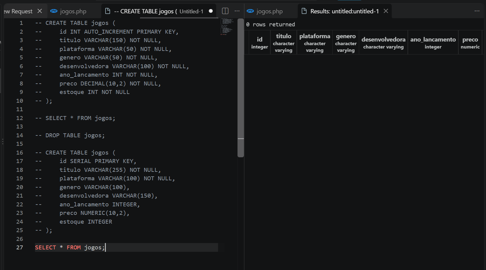

2) CONEXÃO
Ajuste o conexao.php para se conectar ao banco "levelup".

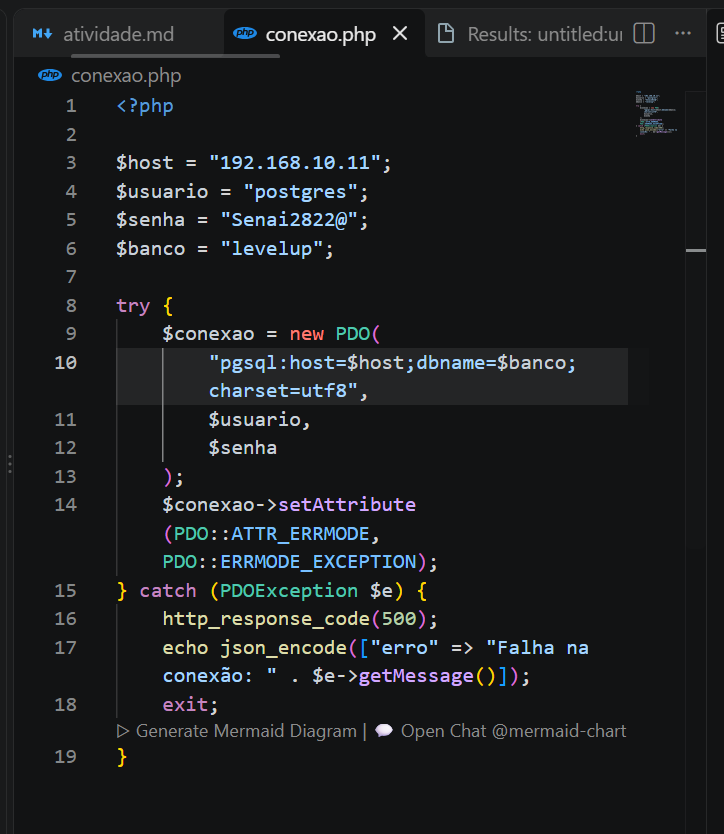

3) API (arquivo jogos.php)
POST: cadastra um jogo e responde {"mensagem": "Jogo cadastrado com sucesso!"}
GET: lista todos os jogos em ordem alfabética pelo título.

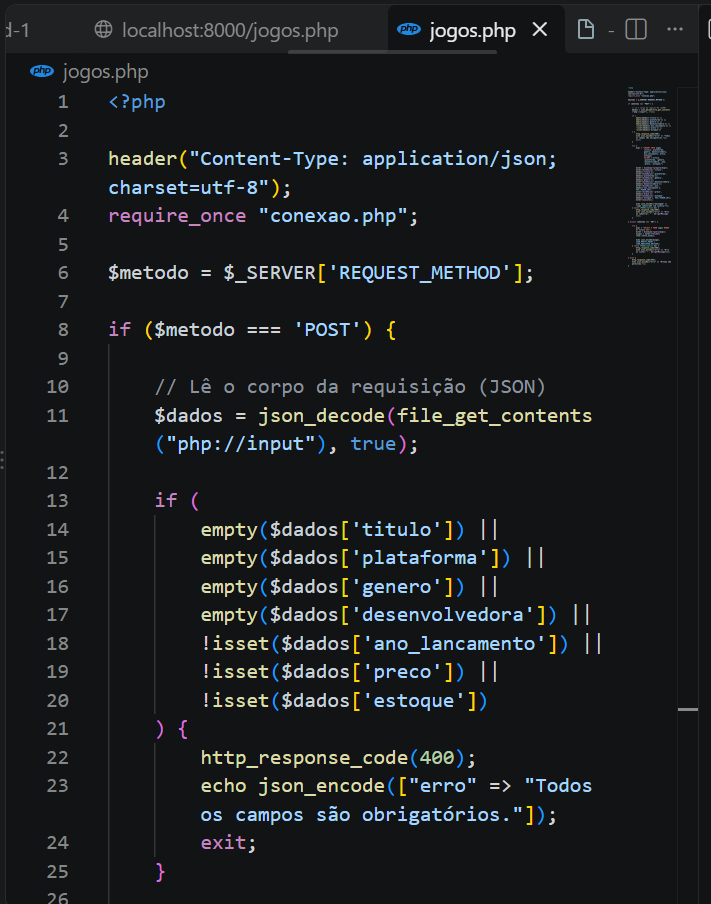
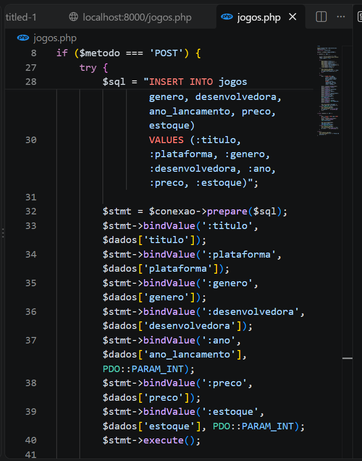
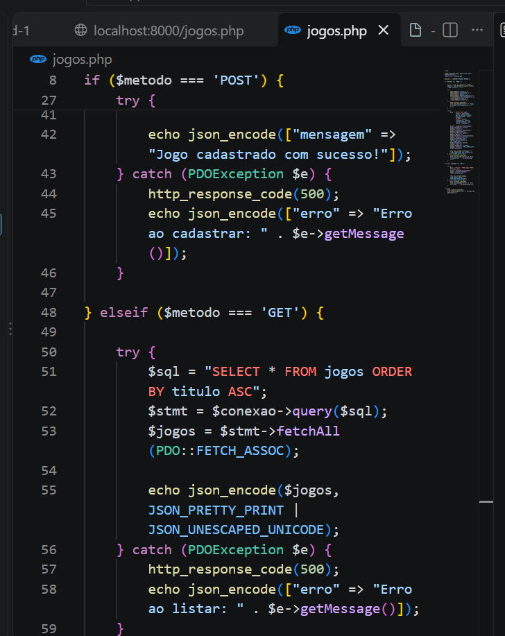
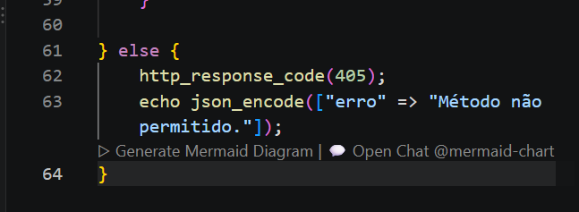

4) TESTES
Cadastre 5 jogos que você gosta. Exemplo de JSON:
{
  "titulo": "Minecraft",
  "plataforma": "PC",
  "genero": "Sandbox",
  "desenvolvedora": "Mojang",
  "ano_lancamento": 2011,
  "preco": 99.90,
  "estoque": 25
}

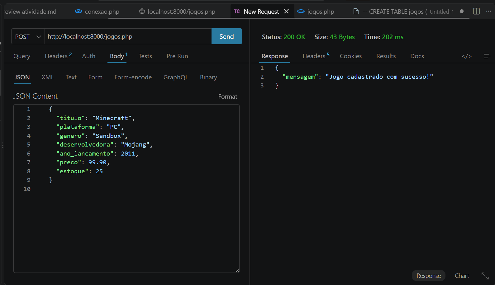
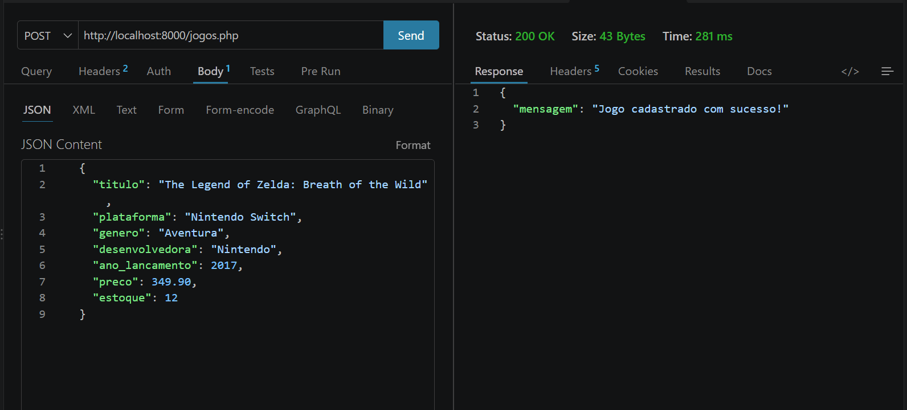
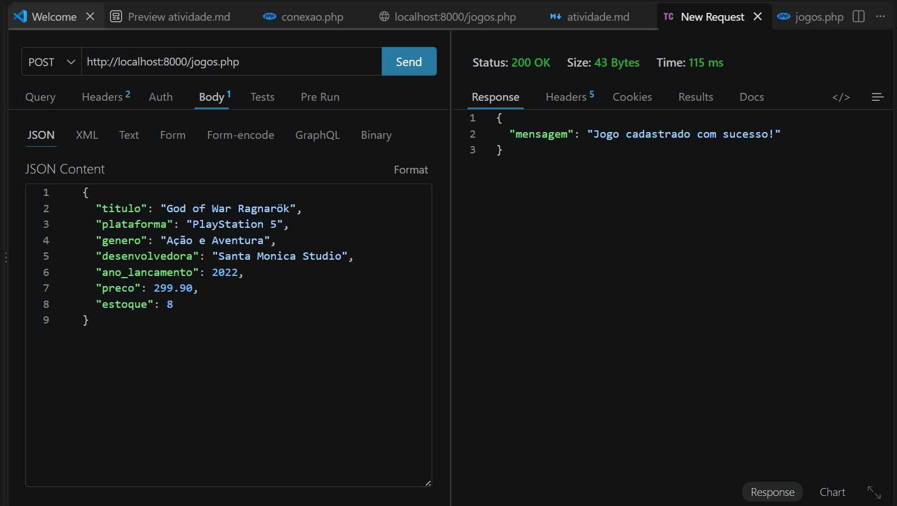
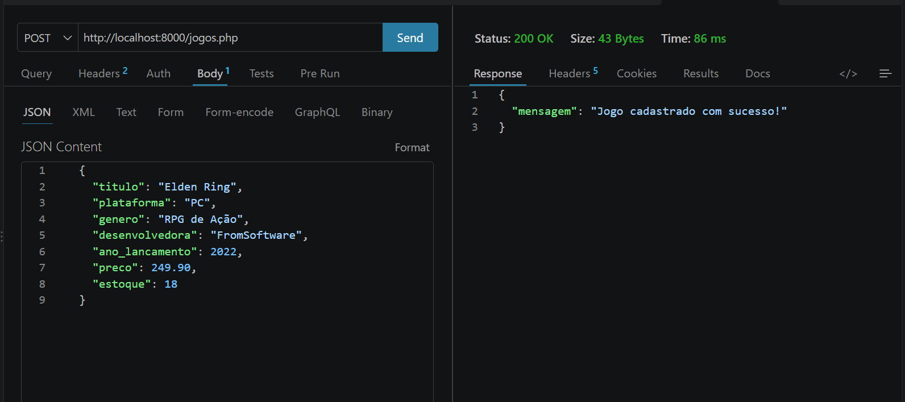
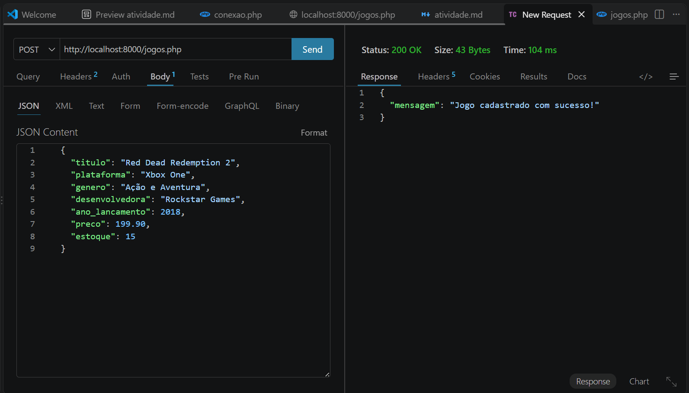

Thunder:
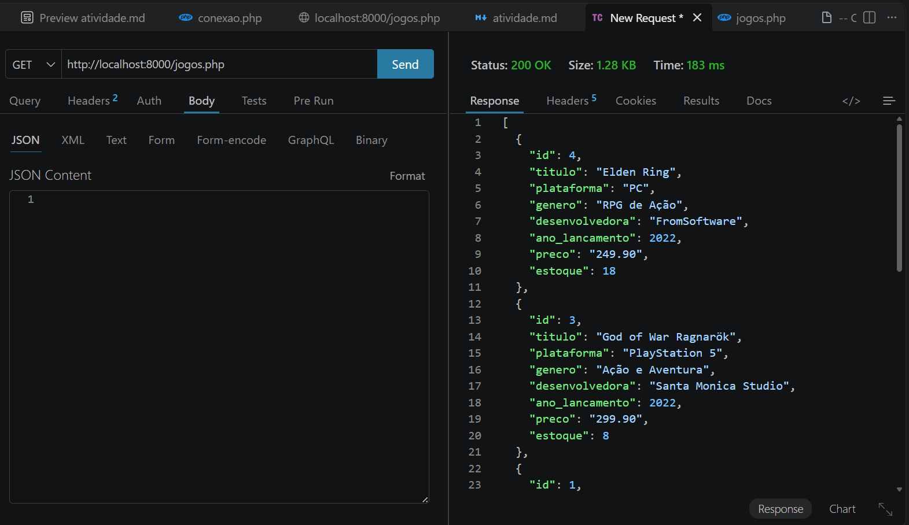
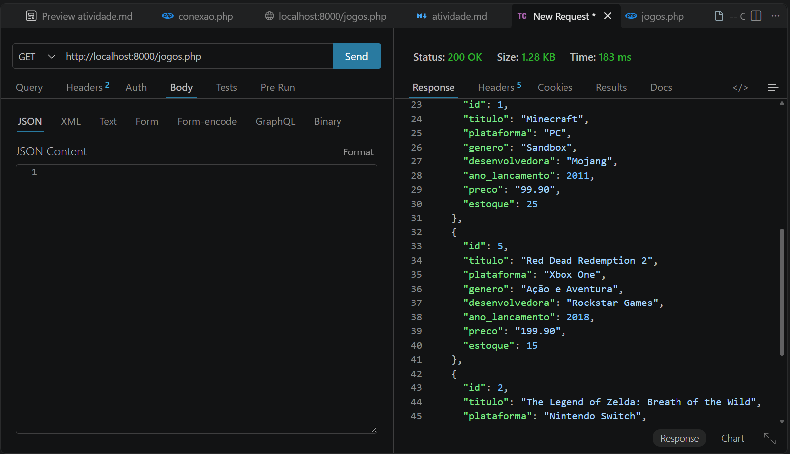
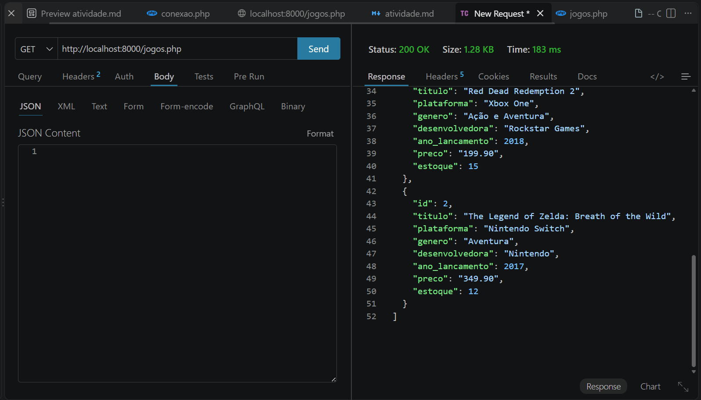

localhost:8000/jogos.php:
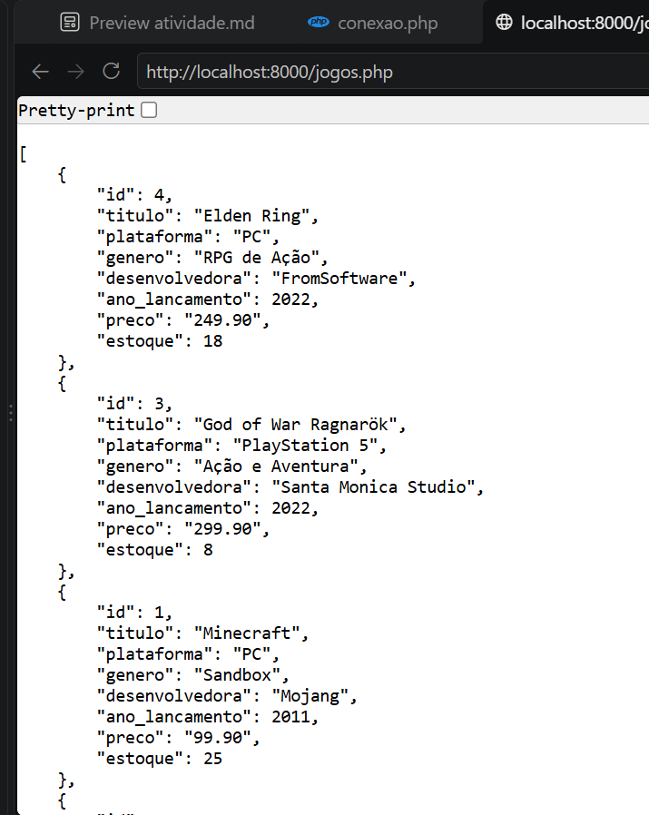
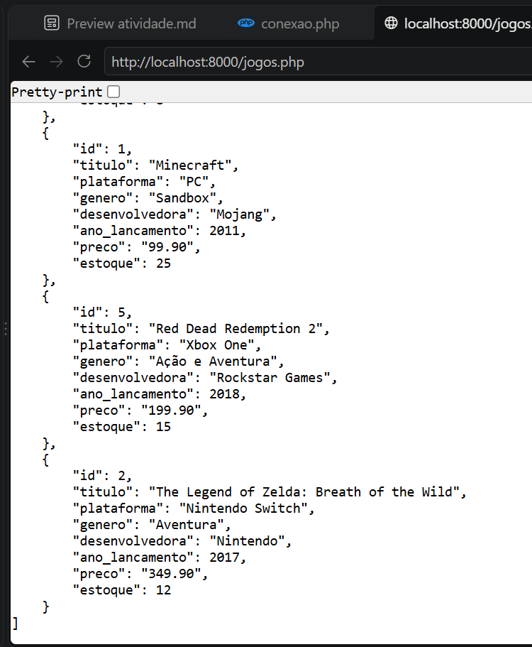

Lembre-se: em JSON, número decimal usa ponto (99.90), não vírgula.